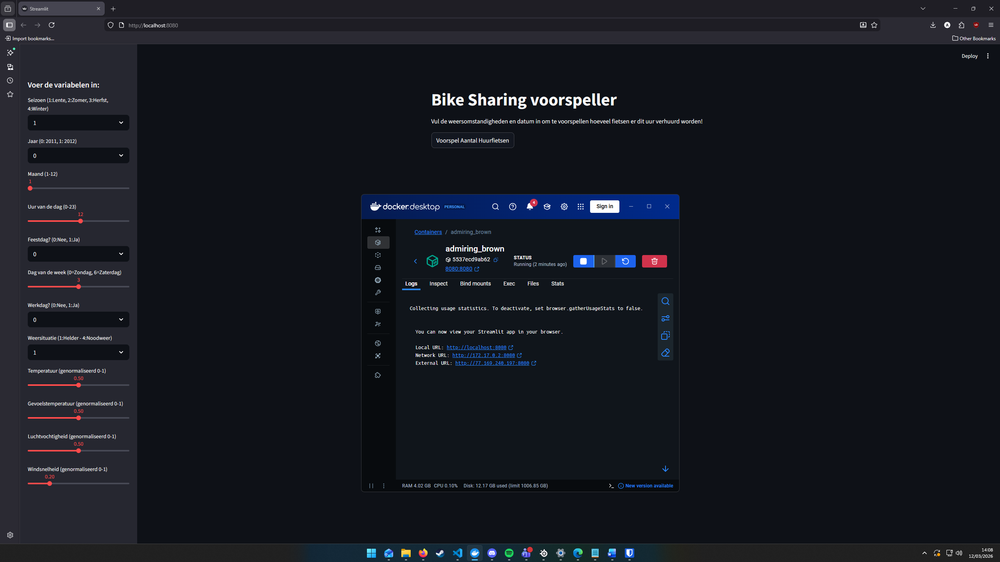
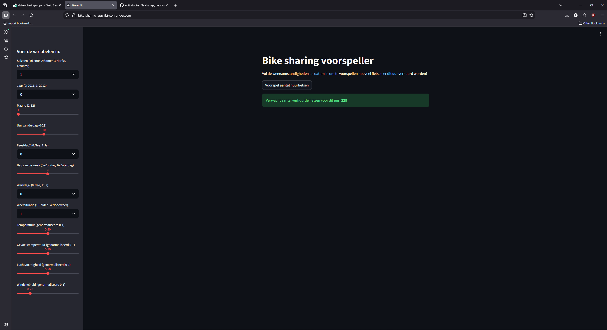

# Practicum 2: Bike Sharing Regressie App

Dit is de oplevering voor Practicum 2. De applicatie voorspelt het aantal verhuurde deelfietsen op basis van weersomstandigheden en tijdstippen met behulp van een Random Forest regressiemodel.

## Live Applicatie (Stap 6)
De applicatie is live te testen via Render:
**[Klik hier om de app te openen](https://bike-sharing-app-ik9v.onrender.com/)** ---

##  Bewijsmateriaal

### 1. Lokaal draaiende Docker Container (Stap 5)
Hieronder zie je de applicatie succesvol draaien via Docker (localhost):

### 2. Live applicatie op Render (Stap 6)
Hieronder zie je de applicatie succesvol voorspellen via de publieke Render URL:
